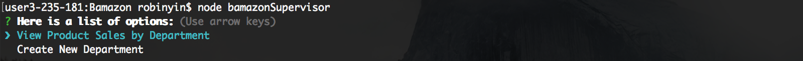
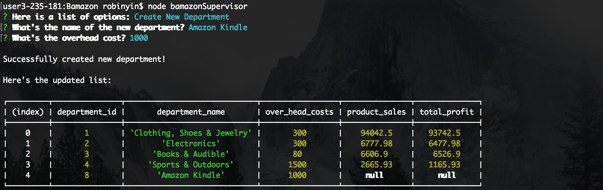

# Bamazon


### This is an Amazon-like storefront command line application. The app will take in orders from customers and deplete stock from the store's inventory. It tracks product sales across the store's departments and provides a summary of the highest-grossing departments in the store.

### Technology Stack: Node.js, JavaScript, MySQL

---

### Customer View

```
node bamazonCustomer
```

This will first display all of the items available for sale, including the ids, names, and prices of products for sale. It will then prompt users with two messages:

- `What's the ID of the product you would like to buy?`
- `How many units would you like to buy?`

Once the customer has placed the order, the app will check if your store has enough of the product to meet the customer's request.

If not, the app will print "Insufficient quantity!", and then prevent the order from going through.

However, if your store does have enough of the product, it will fulfill the customer's order, and show the customer the total cost of their purchase.

#### Examples:


---

### Manager View

```
node bamazonManager
```

Running this application will list a set of menu options:

- `View Products for Sale`
- `View Low Inventory`
- `Add to Inventory`
- `Add New Product`

If a manager selects `View Products for Sale`, the app will list every available item: the item IDs, names, prices, and quantities.

If a manager selects `View Low Inventory`, then it will list all items with an inventory count lower than five.

If a manager selects `Add to Inventory`, the app will display a prompt that will let the manager "add more" of any item currently in the store.

If a manager selects `Add New Product`, it will allow the manager to add a completely new product to the store.

#### Examples:


---

### Supervisor View

```
node bamazonSupervisor
```

Running this application will list a set of menu options:

- `View Product Sales by Department`
- `Create New Department`

When a supervisor selects `View Product Sales by Department` the app will display a summarized table in the terminal/bash window, with department ID, department name, over-head costs, product sales and total profits as columns.

#### Examples:






---
